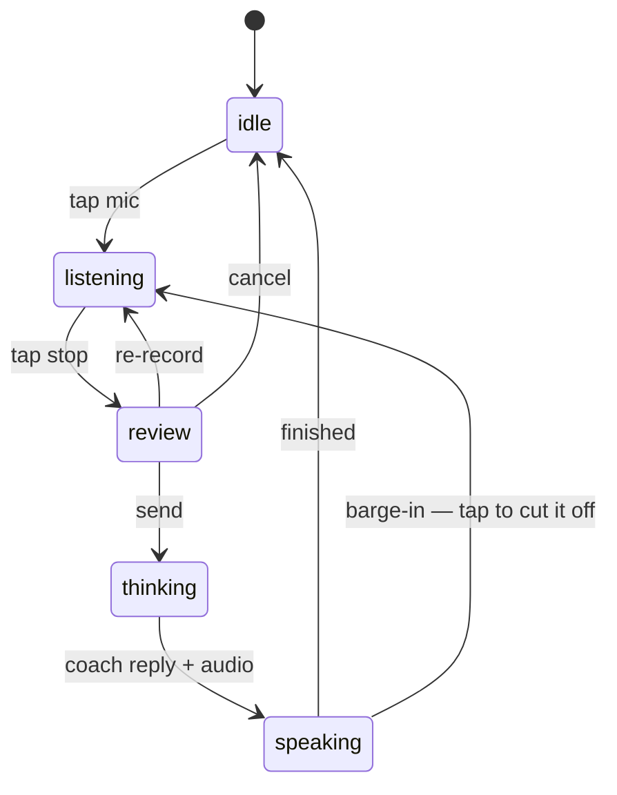

<div align="center">


# SpeakUp

**An English speaking coach that lives on `localhost`.**
You talk. It listens, answers out loud, and — milestone by milestone — starts remembering exactly how you get it wrong.


</div>

---

## Why this exists

You can read English. You can write it. And then someone asks you a question out loud and your brain
returns a 404.

Reading apps don't fix that, because the thing you're bad at is *producing speech under time pressure* —
and multiple choice never puts you under time pressure. A human tutor does, but a human tutor costs
€30/hour, has a calendar, and will politely stop correcting your fifteenth "I have 30 years" because
they don't want to be rude.

SpeakUp is the opposite trade: infinite patience, zero social cost, 3am availability, and a memory that
never lets a mistake quietly become a habit. The transcript, the database, and the grammar pass never
leave your machine. The audio doesn't stay local by default, though: today it's transcribed by the
browser's speech service — Google's servers, on the Chrome path everyone is on — until M6 ships local
Whisper via `voicebox`. See [Endpoints](#endpoints) for the dormant `/turn/audio` path that already
exists for that.

## The loop


That "review + edit" box is not decoration — it's the reason the whole project is built in this order.
See [Grammar](#grammar-the-part-that-actually-matters).

The client is an explicit state machine, not a pile of booleans:



---

## Grammar: the part that actually matters

> **Status: shipped (M2, 2026-08-02).** Both channels — `corrections` and `upgrades` — run in production;
> see the design spec's [§3.1](docs/superpowers/specs/2026-08-02-m2-structured-feedback-design.md#31-why-rule-based-first--and-how-much-it-actually-covers)
> and [§10](docs/superpowers/specs/2026-08-02-m2-structured-feedback-design.md#10-what-can-honestly-be-claimed)
> for exactly what it catches and what it does not.

### Why grammar wasn't built first

Because grammar-checking a speech-to-text transcript is garbage in, garbage out.

The browser's Web Speech API is *accent-forgiving and grammar-flattening by design* — it's optimized to
guess what you meant, so it silently repairs a good chunk of what you actually said. Run a grammar
checker over that transcript and you're grading the ASR engine, not the learner: false confidence on
errors the recognizer erased, phantom errors on words it hallucinated.

So the order is deliberate:

1. **Harden the voice loop first** ← *shipped* — including a **review-and-edit step**, so a human
   confirms the transcript before it becomes the thing being corrected.
2. **Then** put a grammar engine on top of text you can actually trust.

### The engine: two passes, not one

| Pass | Tool | Job | Cost |
|---|---|---|---|
| 1. Mechanical | [Harper](https://github.com/Automattic/harper) — rule-based, local, sub-millisecond | Deterministic, no hallucinations, no API call. | $0 |
| 2. Pedagogical | LLM (`feedback/upgrades.js` — deliberately *not* built on `brain/`: same provider and key, different contract) | *Why* it's wrong, and what a C1 speaker would have said instead. Register, collocation, naturalness. | 1 call/turn |

**Measured, not assumed** (Harper 2.7.0 against a 12-sentence L1-Spanish sample, 2026-08-02): Harper
catches bare subject–verb disagreement (*"She go to school"*, *"he don't like"*) and some collocation
and usage errors (*"discussed about"*, *"since 5 years"*) — but it catches **nothing** from the calque
family that dominates Spanish-speaker English: *"I have 30 years"*, *"I go to home yesterday"*, *"the
people is"*, *"I am agree with you"*, *"I am boring in this class"* all return zero findings. Two of
its five hits in that sample were `Capitalization` lints, which in a speech pipeline come from the
recogniser rather than the learner — those kinds (`Capitalization`, `Punctuation`, `Formatting`,
`Spelling`, `Typo`) are now filtered out at the boundary in `feedback/harper.js`.

An earlier draft of this doc claimed the rule-based pass handles "the boring 70%". **That claim was
wrong for this population and has been withdrawn.** The $0, no-API-key path still gives real, local,
deterministic corrections — it does not give a Spanish speaker a competent grammar checker. What
Harper misses falls through to the LLM pass, which is exactly what the second pass is for. Whether to
add a seq2seq third pass (`vennify/t5-base-grammar-correction`) is deferred to the hand evaluation
tracked in
[`docs/superpowers/plans/voice-io-verification-checklist.md`](docs/superpowers/plans/voice-io-verification-checklist.md) —
twelve sentences justify withdrawing a claim, not adopting a model. See the design spec's
[§3.1](docs/superpowers/specs/2026-08-02-m2-structured-feedback-design.md#31-why-rule-based-first--and-how-much-it-actually-covers).

### Correct is not the goal — the `upgrades` channel

Here's the design decision most coaching tools get wrong. Going from B2 to C1–C2 is **not** driven by
eliminating errors. It's driven by upgrading language that is already correct but plain.

> *"I have a problem with my computer."* — flawless English. Also unmistakably B1.
> A C1 speaker says *"my laptop's been acting up."*

So the feedback payload carries two channels, not one:

- **`corrections`** — you said something wrong → here's right.
- **`upgrades`** — you said something correct and grey → here's what a native would have reached for.

A B2-calibrated coach that only ships `corrections` will cap you at "solid B2" forever.

### The error ledger — a coach that remembers

One-shot correction is forgettable by construction. The ledger is the persistent memory of *your*
specific failure patterns, already modeled in `server/prisma/schema.prisma`:

| Field | What it's for |
|---|---|
| `type` | `grammar` · `vocab` · `register` · `pronunciation` |
| `pattern` | The normalized error signature — the upsert key, so the 12th time is the *same row*, not a new one |
| `frequency` | How stubborn this one is |
| `status` | `active` → `improving` → `resolved` |
| `lastSeenAt` | Fuels "you haven't slipped on this in 3 weeks" |

Alongside it, `VocabItem` carries a `nextReviewAt` for simple SM-2 spaced repetition — so collocations
you *acquired* get resurfaced too, not only errors you made.

---

## Status, honestly

| | Milestone | State |
|---|---|---|
| **M0** | Scaffold — client, server, pluggable brain, Prisma schema | ✅ shipped |
| **M1** | Bare voice loop — speak, get an answer out loud, XP counter | ✅ shipped |
| **M1.5** | **Voice I/O hardening** — `useConversation` state machine, live interim transcript, review/edit before send, barge-in, status + error banners, 93 tests, axe-clean | ✅ shipped `2026-07-24` |
| **M2** | Structured feedback — Harper + LLM, `corrections` + `upgrades`, session fluency + hesitation meters, coach prompt recalibrated to **C1–C2** | ✅ shipped `2026-08-02` |
| **M3** | Persistence — the schema stops being decorative and starts getting written to | ✅ shipped `2026-07-27` |
| **M4** | **Error ledger exploitation** — the coach periodically steers toward a construction the learner keeps failing, and a read-only patterns view shows which habits are changing on evidence, not on silence | ✅ shipped |
| **M4.5** | Vocabulary spaced repetition (`VocabItem`, SM-2) — deliberately deferred out of M4 (spec D1) | planned |
| **M5** | Custom scenarios — job interview, standup, doctor's visit, arguing with a landlord | planned |
| **M6** | Fully offline — local Whisper STT (the `/turn/audio` path already exists, dormant) | planned |
| **M7** | **Accent & prosody** — teaches rhythm, then measures it. Forced alignment (MFA) rather than wav2vec2/GOP, whose best published F1 for open-vocabulary phone-level error detection is 61–63% — a coin flip with authority | 🚧 slices 1–3 |
| **M8** | **Sourced proactivity** — the coach opens on a subject worth arguing about. Phase 1 (a local topic rotation) and phase 2 (RSS/Atom feeds via `SOURCE_FEEDS`, cache-first, falls back to the rotation) have both shipped | ✅ shipped |

**What M7 has actually shipped:** a silent-pause profile computed entirely in the browser (an import-free `AudioWorklet`, an adaptive floor, clause-boundary vs mid-phrase placement anchored on the recognizer's own endpoint decisions), a persistence spine, and a pronunciation provider factory with `none` as a first-class state. The Pronunciation Gym, the echo moment and the scoring sidecar are slices 4–8, gated on two spikes that have not run yet.

Design: [`docs/superpowers/specs/2026-07-26-accent-prosody-layer-design.md`](docs/superpowers/specs/2026-07-26-accent-prosody-layer-design.md).
It is candid about what this cannot do — see its §3.2 (*what it identifies and what it does not*) and §16 (*what can honestly be claimed*).

Known human-verification debt is tracked in
[`docs/superpowers/plans/voice-io-verification-checklist.md`](docs/superpowers/plans/voice-io-verification-checklist.md).

---

## Architecture

Everything with a personality is behind a factory, swappable by env var. Zero lock-in was a hard
requirement — this should outlive whichever provider is fashionable this quarter.

```
speakup/
├── client/               React 19 + Vite + Tailwind v4
│   └── src/
│       ├── hooks/useConversation.js   ← the state machine (the brain of the UI)
│       ├── lib/speech.js              ← Web Speech STT + SpeechSynthesis wrapper
│       ├── lib/micStream.js           ← the ONLY file that touches getUserMedia or Web Audio
│       ├── lib/prosody/               ← pcm.worklet.js (import-free) + pure pause analysis
│       └── components/                ← MicButton, TranscriptReview, VoiceStatus, PauseNote…
└── server/               Express 5
    ├── prisma/           SQLite, and no longer decorative
    └── src/
        ├── app.js        builds the app · index.js only listens, so tests can import it
        ├── db.js         the lazy PrismaClient singleton
        ├── repo/         the only module that reads or writes Session / Turn
        ├── brain/        mock | mistral      → evaluateTurn(ctx)
        ├── tts/          kokoro | voicebox | browser
        ├── stt/          voicebox | none     (server-side path, dormant until M6)
        ├── pronunciation/ local | mock | none  (sidecar arrives in slice 3)
        ├── seed/         feeds | local        → the coach's opening topic (M8)
        ├── coach/        probe.js             → which recurring mistake to elicit next (M4)
        ├── ledger/       transitions.js       → the ErrorLedger status state machine (M4)
        ├── feedback/     Harper (mechanical) + LLM (pedagogical) → corrections + upgrades (M2)
        ├── metrics/      hesitation (per turn) + session fluency — internal indices, no external calibration
        └── prompts/      the coach's personality lives here — not in the weights; m1 | m2 via COACH_PROMPT
```

Two boundaries are load-bearing rather than stylistic. `micStream.js` is the only file allowed to
touch Web Audio — which is what keeps `useConversation` testable, since jsdom has none. And `repo/` is
the only module that talks to Prisma, which is where the JSON encode/decode lives so no caller ever
sees a string where it expects an object.

| Slot | Options | Default | Notes |
|---|---|---|---|
| **brain** | `mock`, `mistral` | auto | No key → `mock`, offline and free. Key present → Mistral. |
| **tts** | `kokoro`, `voicebox`, `browser` | `kokoro` | If TTS dies mid-turn the server still returns the turn and the client falls back to the browser voice. The loop never breaks because a container is down. |
| **stt** | `voicebox`, unset | unset | Unset = browser Web Speech. Set = server transcribes (`POST /turn/audio`). |
| **pron** | `local`, `mock`, `none` | `none` | `none` is a supported state, not an error — no scorer means an unscored card, nothing throws. There is deliberately **no health probe**: reachability is whatever the score call returns, so starting the sidecar mid-session just works on the next attempt. |
| **sources** | `feeds`, `local` | auto | No `SOURCE_FEEDS` → the coach opens from a built-in topic rotation. Set it to a comma-separated list of RSS/Atom feed URLs and it opens on topics pulled from those instead — cache-first, refreshed in the background at boot, never blocking session start. A dead or empty feed degrades to the rotation invisibly. |
| **`COACH_PROMPT`** | `m2`, `m1` | `m2` | `m2` is the pushier C1–C2 coach; `m1` is the frozen pre-M2 baseline, kept so the two can be compared on real conversation. See the M2 spec §3 D3. |

> On models: the coach's pedagogy lives in `server/src/prompts/coach-system.js`, **not** in fine-tuned
> weights. The HuggingFace "english teacher" fine-tunes are hobbyist checkpoints with empty model cards
> and no eval metrics — every one of them is weaker than a good prompt on a decent general model. The
> real model-shaped gaps are narrow and specific: forced alignment (M7) and grammatical error correction
> (M2, shipped as the Harper + LLM two-pass — not a CEFR classifier; there isn't one in this milestone,
> see [Grammar](#grammar-the-part-that-actually-matters)). Note that M7 deliberately does **not** do
> open-vocabulary phoneme scoring — see the design spec's §3.2 for why a 61–63% F1 detector is worse
> than no detector.

### Endpoints

| | |
|---|---|
| `GET /health` | `{ status, brain, tts, stt, pron, feedback, ts }` — the UI renders these as live pills |
| `POST /turn` | `{ utterance, history, sessionId?, prosody?, captureSettings? }` → `{ coach_reply, xp, audio?, audioFormat?, ttsProvider, sessionId, turnId }` — `turnId` is what `POST /feedback` attaches to |
| `GET /patterns` | → `{ patterns: [{ example, frequency, status, probesPassed, lastSeenAt, lastProbedAt }] }` — read-only (M4); a pattern's `status` reflects deliberate elicitation outcomes, not silence — see the design spec's §10 for what can and cannot be honestly claimed from it |
| `POST /turn/open` | `{ sessionId? }` → `{ coach_reply, xp, audio?, audioFormat?, ttsProvider, sessionId, seedProvider }` — the coach's first turn, before the learner has spoken |
| `POST /turn/audio` | multipart `{ audio, history? }` → adds `transcript`. Returns `501` unless `STT_PROVIDER` is set |
| `POST /feedback` | `{ utterance, turnId?, history?, prosody?, sessionPhonationMs?, sessionSyllables?, probedPattern? }` → `{ corrections, upgrades, hesitation, sessionFluency, passes, probeResult }` — deferred, per-turn structured feedback (M2) plus M4's probe-outcome resolution, idempotent by `turnId`; persistence failing costs a row, never the response |

`sessionId` comes back `null` when the server could not write to the one it was given — that is the
signal to start a fresh session, not to retry a dead one. Persistence failing costs a row, never the
turn: the same rule the TTS path has always followed.

---

## Quick start

```bash
npm run install:all        # root + server + client
npm run prisma:migrate     # create the SQLite db (name it "init")
npm run dev                # both processes, one terminal
```

Open the URL Vite prints (usually <http://localhost:5173>). It works immediately with **no API key** —
the mock brain is offline and free, and the browser handles voice on both ends.

**Chrome or Edge** for the mic (Web Speech API support). Every other browser still works via the text
input — the fallback is a first-class path, not an afterthought.

### Turning on the good stuff

```bash
# a real brain
echo "MISTRAL_API_KEY=sk-..." >> server/.env      # auto-detected on restart

# a real voice (Kokoro, local, free)
docker run -p 8880:8880 ghcr.io/remsky/kokoro-fastapi-cpu
# server/.env already defaults to TTS_PROVIDER=kokoro
```

`GET /health` reports which providers actually came up. See `server/.env.example` for every knob.

---

## Tests

**281 tests** — 183 on the client (Vitest + Testing Library + jsdom) and 98 on the server (Vitest, node
environment, binding port 0 so they never collide with a running dev server). Coverage is gated at 80%
on four metrics for the files where the bodies are buried: `useConversation.js`, `speech.js`,
`micStream.js`, `lib/prosody/**` on the client, and `server/src/feedback/**` + `server/src/metrics/**`
on the server. Plus `jest-axe` assertions on the components.

```bash
npm test                              # both suites
npm --prefix client run test:coverage
```

Voice code is *unusually* worth testing, because the failure modes are all timing: Web Speech
self-terminates on silence unless `continuous=true`, restarts race against user-initiated stops, and
`InvalidStateError` shows up only on the restart path. Those are exactly the bugs you can't reproduce on
demand — so they're pinned by tests instead.

The prosody work added a second category: **arithmetic with no reference implementation to check
against**. The pause detector and the syllable-nuclei logic are ported from published prose rather than
from the authors' scripts, which are GPL — so there are no golden values to compare to. They're tested
with constructed signals whose answers are known in closed form: a tone, exactly 400 ms of silence,
another tone, and the assertion that exactly one pause of 380–420 ms comes out. Nothing in the fixture
directory, nothing to drift.

### Pre-push hook

There is no CI on this project (spec §12), so a `pre-push` git hook running the full suite (`npm test`
from the repo root) is the only automatic enforcement of the tests and the 80% coverage gate. It's not
enabled by default — run this once per clone:

```bash
git config core.hooksPath .githooks
```

---

## Design

Dark "coach studio" direction — deliberately not a default template. Tokens live in
`client/src/index.css`:

| | | |
|---|---|---|
| `--color-coach` | `#8b6cff` | violet — the coach's voice |
| `--color-user` | `#ffb35c` | amber — yours |
| `--color-accent` | `#2ee6a6` | mint — XP, "it worked" |
| `--color-ink` | `#0e0b16` | near-black with a purple bias |

Motion is compositor-only (`transform` / `opacity`) and every animation is disabled under
`prefers-reduced-motion`.

---

## Principles

1. **Local-first, honestly scoped.** The transcript, the database, and the grammar pass stay on your
   machine. The audio itself is transcribed via the browser's speech service (Google's, by default in
   Chrome) until M6 ships local Whisper — see [Why this exists](#why-this-exists). The cloud brain is
   opt-in and swappable for a local one.
2. **$0 by default.** Mock brain, browser voice, SQLite. Paying for a better model is an upgrade, never
   a requirement to start.
3. **Degrade, never break.** TTS down → browser voice. No mic → text input. No key → mock brain.
4. **Consistency beats intensity.** XP and streaks aren't the product, they're the adherence mechanism.
   The best coach is the one you actually open on a Tuesday.

---

## License

TBD — open an issue if you want to use this for something.
