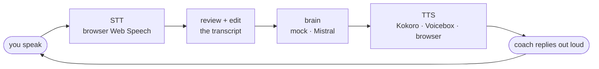
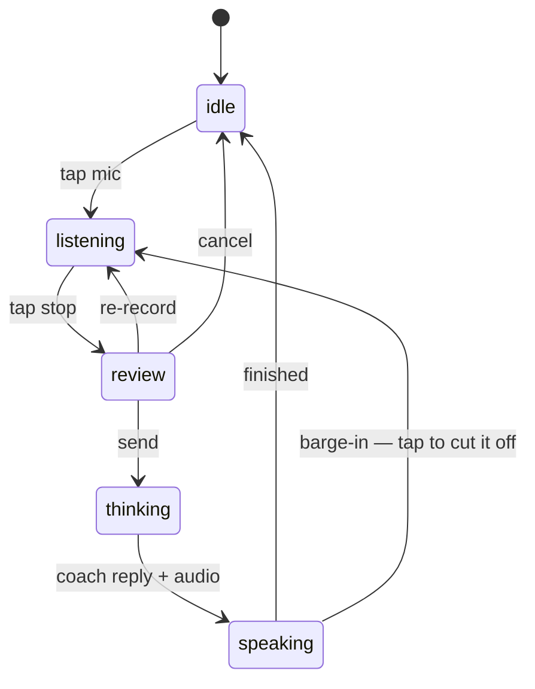

<div align="center">


# SpeakUp

**An English speaking coach that lives on `localhost`.**
You talk. It listens, answers out loud, and — milestone by milestone — starts remembering exactly how you get it wrong.


</div>

---

## Why this exists

You can read English. You can write it. And then someone asks you a question out loud and your brain
returns a 404.

Reading apps don't fix that, because the thing you're bad at is *producing speech under time pressure* —
and multiple choice never puts you under time pressure. A human tutor does, but a human tutor costs
€30/hour, has a calendar, and will politely stop correcting your fifteenth "I have 30 years" because
they don't want to be rude.

SpeakUp is the opposite trade: infinite patience, zero social cost, 3am availability, and a memory that
never lets a mistake quietly become a habit. It runs entirely on your machine — the mic never leaves
the building.

## The loop



That "review + edit" box is not decoration — it's the reason the whole project is built in this order.
See [Grammar](#grammar-the-part-that-actually-matters).

The client is an explicit state machine, not a pile of booleans:



---

## Grammar: the part that actually matters

> **Status: not shipped yet — this is the next milestone (M2), and it is the point of the project.**
> Everything through M1 exists to make this part trustworthy.

### Why grammar wasn't built first

Because grammar-checking a speech-to-text transcript is garbage in, garbage out.

The browser's Web Speech API is *accent-forgiving and grammar-flattening by design* — it's optimized to
guess what you meant, so it silently repairs a good chunk of what you actually said. Run a grammar
checker over that transcript and you're grading the ASR engine, not the learner: false confidence on
errors the recognizer erased, phantom errors on words it hallucinated.

So the order is deliberate:

1. **Harden the voice loop first** ← *shipped* — including a **review-and-edit step**, so a human
   confirms the transcript before it becomes the thing being corrected.
2. **Then** put a grammar engine on top of text you can actually trust.

### The planned engine: two passes, not one

| Pass | Tool | Job | Cost |
|---|---|---|---|
| 1. Mechanical | [Harper](https://github.com/Automattic/harper) — rule-based, local, sub-millisecond | Articles, agreement, tense, prepositions. Deterministic, no hallucinations, no API call. | $0 |
| 2. Pedagogical | LLM (`brain/`) | *Why* it's wrong, and what a C1 speaker would have said instead. Register, collocation, naturalness. | 1 call/turn |

Rule-based first means the boring 70% never depends on a model's mood, and the LLM budget goes to the
part only a model can do: explaining and upgrading.
(Fallback if Harper's recall proves too low for L2 Spanish speakers: `vennify/t5-base-grammar-correction`.)

### Correct is not the goal — the `upgrades` channel

Here's the design decision most coaching tools get wrong. Going from B2 to C1–C2 is **not** driven by
eliminating errors. It's driven by upgrading language that is already correct but plain.

> *"I have a problem with my computer."* — flawless English. Also unmistakably B1.
> A C1 speaker says *"my laptop's been acting up."*

So the feedback payload carries two channels, not one:

- **`corrections`** — you said something wrong → here's right.
- **`upgrades`** — you said something correct and grey → here's what a native would have reached for.

A B2-calibrated coach that only ships `corrections` will cap you at "solid B2" forever.

### The error ledger — a coach that remembers

One-shot correction is forgettable by construction. The ledger is the persistent memory of *your*
specific failure patterns, already modeled in `server/prisma/schema.prisma`:

| Field | What it's for |
|---|---|
| `type` | `grammar` · `vocab` · `register` · `pronunciation` |
| `pattern` | The normalized error signature — the upsert key, so the 12th time is the *same row*, not a new one |
| `frequency` | How stubborn this one is |
| `status` | `active` → `improving` → `resolved` |
| `lastSeenAt` | Fuels "you haven't slipped on this in 3 weeks" |

Alongside it, `VocabItem` carries a `nextReviewAt` for simple SM-2 spaced repetition — so collocations
you *acquired* get resurfaced too, not only errors you made.

---

## Status, honestly

| | Milestone | State |
|---|---|---|
| **M0** | Scaffold — client, server, pluggable brain, Prisma schema | ✅ shipped |
| **M1** | Bare voice loop — speak, get an answer out loud, XP counter | ✅ shipped |
| **M1.5** | **Voice I/O hardening** — `useConversation` state machine, live interim transcript, review/edit before send, barge-in, status + error banners, 93 tests, axe-clean | ✅ shipped `2026-07-24` |
| **M2** | Structured feedback — Harper + LLM, `corrections` + `upgrades`, fluency/confidence meters, CEFR rubric recalibrated to **C1–C2** | ⏭️ next |
| **M3** | Persistence — the schema stops being decorative and starts getting written to | planned |
| **M4** | Error ledger + vocab spaced repetition | planned |
| **M5** | Custom scenarios — job interview, standup, doctor's visit, arguing with a landlord | planned |
| **M6** | Fully offline — local Whisper STT (the `/turn/audio` path already exists, dormant) | planned |
| **M7** | Pronunciation (CAPT) — phoneme-level scoring via wav2vec2/GOP, because STT *erases* the thing being graded | planned |

Known human-verification debt is tracked in
[`docs/superpowers/plans/voice-io-verification-checklist.md`](docs/superpowers/plans/voice-io-verification-checklist.md).

---

## Architecture

Everything with a personality is behind a factory, swappable by env var. Zero lock-in was a hard
requirement — this should outlive whichever provider is fashionable this quarter.

```
speakup/
├── client/               React 19 + Vite + Tailwind v4
│   └── src/
│       ├── hooks/useConversation.js   ← the state machine (the brain of the UI)
│       ├── lib/speech.js              ← Web Speech STT + SpeechSynthesis wrapper
│       └── components/                ← MicButton, TranscriptReview, VoiceStatus…
└── server/               Express 5
    └── src/
        ├── brain/        mock | mistral      → evaluateTurn(ctx)
        ├── tts/          kokoro | voicebox | browser
        ├── stt/          voicebox | none     (server-side path, dormant until M6)
        └── prompts/      the coach's personality lives here — not in the weights
```

| Slot | Options | Default | Notes |
|---|---|---|---|
| **brain** | `mock`, `mistral` | auto | No key → `mock`, offline and free. Key present → Mistral. |
| **tts** | `kokoro`, `voicebox`, `browser` | `kokoro` | If TTS dies mid-turn the server still returns the turn and the client falls back to the browser voice. The loop never breaks because a container is down. |
| **stt** | `voicebox`, unset | unset | Unset = browser Web Speech. Set = server transcribes (`POST /turn/audio`). |

> On models: the coach's pedagogy lives in `server/src/prompts/coach-system.js`, **not** in fine-tuned
> weights. The HuggingFace "english teacher" fine-tunes are hobbyist checkpoints with empty model cards
> and no eval metrics — every one of them is weaker than a good prompt on a decent general model. The
> real model-shaped gaps are narrow and specific: phoneme scoring (M7), CEFR classification (M2),
> grammatical error correction (M2).

### Endpoints

| | |
|---|---|
| `GET /health` | `{ status, brain, tts, stt, ts }` — the UI renders these as live pills |
| `POST /turn` | `{ utterance, history }` → `{ coach_reply, xp, audio?, audioFormat?, ttsProvider }` |
| `POST /turn/audio` | multipart `{ audio, history? }` → adds `transcript`. Returns `501` unless `STT_PROVIDER` is set |

---

## Quick start

```bash
npm run install:all        # root + server + client
npm run prisma:migrate     # create the SQLite db (name it "init")
npm run dev                # both processes, one terminal
```

Open the URL Vite prints (usually <http://localhost:5173>). It works immediately with **no API key** —
the mock brain is offline and free, and the browser handles voice on both ends.

**Chrome or Edge** for the mic (Web Speech API support). Every other browser still works via the text
input — the fallback is a first-class path, not an afterthought.

### Turning on the good stuff

```bash
# a real brain
echo "MISTRAL_API_KEY=sk-..." >> server/.env      # auto-detected on restart

# a real voice (Kokoro, local, free)
docker run -p 8880:8880 ghcr.io/remsky/kokoro-fastapi-cpu
# server/.env already defaults to TTS_PROVIDER=kokoro
```

`GET /health` reports which providers actually came up. See `server/.env.example` for every knob.

---

## Tests

93 client tests (Vitest + Testing Library + jsdom), ~99% coverage on the two files where the bodies are
buried — `useConversation.js` and `speech.js` — plus `jest-axe` accessibility assertions on the
components.

```bash
npm --prefix client test
npm --prefix client run test:coverage
```

Voice code is *unusually* worth testing, because the failure modes are all timing: Web Speech
self-terminates on silence unless `continuous=true`, restarts race against user-initiated stops, and
`InvalidStateError` shows up only on the restart path. Those are exactly the bugs you can't reproduce on
demand — so they're pinned by tests instead.

---

## Design

Dark "coach studio" direction — deliberately not a default template. Tokens live in
`client/src/index.css`:

| | | |
|---|---|---|
| `--color-coach` | `#8b6cff` | violet — the coach's voice |
| `--color-user` | `#ffb35c` | amber — yours |
| `--color-accent` | `#2ee6a6` | mint — XP, "it worked" |
| `--color-ink` | `#0e0b16` | near-black with a purple bias |

Motion is compositor-only (`transform` / `opacity`) and every animation is disabled under
`prefers-reduced-motion`.

---

## Principles

1. **Local-first.** Your voice is the most personal data you have. It stays on the machine. The cloud
   brain is opt-in and swappable for a local one.
2. **$0 by default.** Mock brain, browser voice, SQLite. Paying for a better model is an upgrade, never
   a requirement to start.
3. **Degrade, never break.** TTS down → browser voice. No mic → text input. No key → mock brain.
4. **Consistency beats intensity.** XP and streaks aren't the product, they're the adherence mechanism.
   The best coach is the one you actually open on a Tuesday.

---

## License

TBD — open an issue if you want to use this for something.
